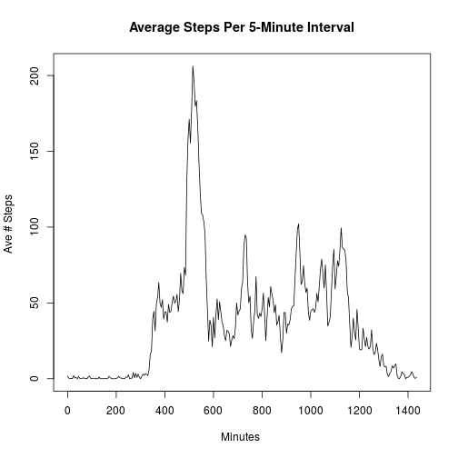

### Author: Rafael Espericueta  
### Email: rafaelespericueta@gmail.com

### Loading and preprocessing the data

1. Load the data file:

```r
data <- read.csv('activity.csv', stringsAsFactors = FALSE)
```

2. Process/transform the data:
First we convert the interval codes to the beginning of each interval, in minutes after midnight. Then we create a subset *dat*, that excludes all NA values from the steps column.

```r
data$minutes <- 0   # a new minutes past midnight column
dayblock <- 5 * 0:287
newcol <- c(dayblock)
for (i in 2:length(unique(data$date))) {
    newcol <- c(newcol, dayblock)
}
data$minutes <- newcol  # append this new column 
# Extract the complete data
dat <- subset(data, !is.na(steps))  # subset out all the complete data
```

### What is mean total number of steps taken per day?

1. Make a histogram of the total number of steps taken each day:

```r
library(ggplot2)
day_steps <- data.frame(character(), numeric(), stringsAsFactors=FALSE)
for (day in unique(dat$date)) {
    this_sum <- sum(subset(dat, date == day,
                           select = c(date, steps))$steps)
    this_row <- data.frame(day, this_sum, stringsAsFactors=FALSE)
    day_steps <- rbind(day_steps, this_row)
}
colnames(day_steps) <- c("date", "total_steps")

qplot(x = total_steps, data = day_steps, 
      main = "Histogram of the Total # of Steps per Day",
      xlab = "# Steps per Day ",
      ylab = "# Days ",
      ) + geom_histogram(colour = "blue",
                         fill = "green") + scale_y_continuous(breaks = c(0:40))
```

```
## stat_bin: binwidth defaulted to range/30. Use 'binwidth = x' to adjust this.
## stat_bin: binwidth defaulted to range/30. Use 'binwidth = x' to adjust this.
```

 

2. Calculate and report the mean and median total number of steps taken per day:

```r
mean_steps = mean(day_steps$total_steps)
median_steps = median(day_steps$total_steps)
# Mean
mean_steps
```

```
## [1] 10766.19
```

```r
# Median
median_steps
```

```
## [1] 10765
```
The mean number of steps taken per day is about 1.0766189 &times; 10<sup>4</sup>, 
while the median number of steps taken per day is about 10765.

### What is the average daily activity pattern?

1. Make a time series plot (i.e. type = "l") of the 5-minute interval (x-axis) and the average number of steps taken, averaged across all days (y-axis):

```r
interval_means <- data.frame(minutes = numeric(), mean_steps = numeric())
for (minute in unique(dat$minutes)) {
    this_mean <- mean(subset(dat, minutes == minute, 
                             select = c(minutes, steps))$steps)
    interval_means <- rbind(interval_means, c(minute, this_mean))
}
colnames(interval_means) <- c("minutes", "mean_steps")

plot(interval_means$minutes, interval_means$mean_steps, type="l", 
     xlab="Minutes ", ylab="Ave # Steps ", 
     main="Average Steps Per 5-Minute Interval")
```

 

2. Which 5-minute interval, on average across all the days in the dataset, contains the maximum number of steps?

```r
max_steps <- max(interval_means$mean_steps)
max_activity_time <- subset(interval_means, mean_steps == max_steps, 
                            select = minutes)$minutes
max_steps
```

```
## [1] 206.1698
```
The maximum activity seems to occur at the interval beginning at 515 minutes, 
(which represents the interval from 8:35 - 8:40 am). the maximum average number of steps in this interval is about 206.17.

### Imputing missing values

1. Calculate and report the total number of missing values in the dataset (i.e. the total number of rows with NAs):

Since the original dataframe was *data*, and removing all the NA rows yields dataframe *dat*, it
follows that the number of rows with NA is the difference in length of these two dataframes.  

```r
num_NA <- nrow(data) - nrow(dat)
```
The number of rows containing NA is 2304.


2. Devise a strategy for filling in all of the missing values in the dataset:

To impute the missing values, we'll replace each NA with the mean for that 5-minute interval accross all days for which this data is not missing.

3. Create a new dataset that is equal to the original dataset but with the missing data filled in:

```r
data_imp = data
for (i in c(1:nrow(data_imp))) {
    if (is.na(data_imp[i, 1])) {
        data_imp[i, 1] <- interval_means[interval_means$minutes == data_imp[i, 4], 2]
    }
}
```

4. Make a histogram of the total number of steps taken each day and Calculate and report the mean and median total number of steps taken per day. Do these values differ from the estimates from the first part of the assignment? What is the impact of imputing missing data on the estimates of the total daily number of steps?

Now we repeat the previous analysis, but this time with the imputed missing values.

```r
day_steps_imp <- data.frame(character(), numeric(), stringsAsFactors=FALSE)
for (day in unique(data_imp$date)) {
    this_sum <- sum(subset(data_imp, date == day,
                           select = c(date, steps))$steps)
    this_row <- data.frame(day, this_sum, stringsAsFactors=FALSE)
    day_steps_imp <- rbind(day_steps_imp, this_row)
}
colnames(day_steps_imp) <- c("date", "total_steps")

qplot(x = total_steps, data = day_steps_imp, 
      main = "Histogram of the Total # of Steps per Day with Imputed NAs",
      xlab = "# Steps per Day ",
      ylab = "# Days ",
      ) + geom_histogram(colour = "blue",
                         fill = "green") + scale_y_continuous(breaks = c(0:40))
```

```
## stat_bin: binwidth defaulted to range/30. Use 'binwidth = x' to adjust this.
## stat_bin: binwidth defaulted to range/30. Use 'binwidth = x' to adjust this.
```

 

```r
# Mean and median:
mean_steps_imp = mean(day_steps_imp$total_steps)
median_steps_imp = median(day_steps_imp$total_steps)
#
# Mean
mean_steps_imp
```

```
## [1] 10766.19
```

```r
# Median
median_steps_imp
```

```
## [1] 10766.19
```
The new means are identical to the old ones, as one would expect, since the imputed values are equal to the means for the non-missing data for each time interval. Interestingly, with the imputed values, the new median now precisely equals the mean, whereas in the first part of the assignment the median was slightly less (by about 1.2) than the mean. Previously the median came out as an integer, but now that we've imputed floating point values for the previous NAs, now the median *can* equal the mean. Since all those original NA's are now equal to the mean, the mean value is now in the bin with the most values. And so the histogram shows a slightly higher peak (12 days vs 9 days), which is due to all those replaced NAs.


### Are there differences in activity patterns between weekdays and weekends?

1. Create a new factor variable in the dataset with two levels -- "weekday" and "weekend" indicating whether a given date is a weekday or weekend day:

```r
data_imp$day_type <- 'weekday'
weekend <- (weekdays(as.Date(data_imp$date)) == 'Saturday') |
           (weekdays(as.Date(data_imp$date)) == 'Sunday')
data_imp[weekend, 5] <- 'weekend'
data_imp$day_type <- as.factor(data_imp$day_type)
```

2. Make a panel plot containing a time series plot (i.e. type = "l") of the 5-minute interval (x-axis) and the average number of steps taken, averaged across all weekday days or weekend days (y-axis):

```r
week_day <- data_imp$day_type == 'weekday'
dat_weekday <- data_imp[week_day, ]    # extract weekday data
dat_weekend <- data_imp[!week_day, ]   # extract weekend data

# Initialize a new dataframe
interval_weekday_means <- data.frame(minutes=numeric(), mean_steps=numeric())
for (minute in unique(dat_weekday$minutes)) {
    this_mean <- mean(subset(dat_weekday, minutes == minute, 
                             select = c(minutes, steps))$steps)
    interval_weekday_means <- rbind(interval_weekday_means, c(minute, this_mean))
}
colnames(interval_weekday_means) <- c("minutes", "mean_steps")

# Initialize a new dataframe
interval_weekend_means <- data.frame(minutes=numeric(), mean_steps=numeric())
for (minute in unique(dat_weekend$minutes)) {
    this_mean <- mean(subset(dat_weekend, minutes == minute, 
                             select = c(minutes, steps))$steps)
    interval_weekend_means <- rbind(interval_weekend_means, c(minute, this_mean))
}
colnames(interval_weekend_means) <- c("minutes", "mean_steps")

# Make sure both plots use the same vertical scale.
minY = min(interval_weekend_means$mean_steps, interval_weekday_means$mean_steps)
maxY = max(interval_weekend_means$mean_steps, interval_weekday_means$mean_steps)

par(mfrow=c(2, 1))

plot(interval_weekday_means$minutes, interval_weekday_means$mean_steps, type="l", 
     ylim = c(minY, maxY),
     xlab = "Minutes ", ylab = "Ave # Steps ", 
     main = "Weekday Average Steps Per 5-Minute Interval")

plot(interval_weekend_means$minutes, interval_weekend_means$mean_steps, type="l", 
     ylim = c(minY, maxY),
     xlab = "Minutes ", ylab = "Ave # Steps ", 
     main = "Weekend Average Steps Per 5-Minute Interval")
```

 

```r
weekday_mean <- mean(interval_weekday_means$mean_steps)
weekend_mean <- mean(interval_weekend_means$mean_steps)
# Mean
weekday_mean
```

```
## [1] 35.61058
```

```r
# Median
weekend_mean
```

```
## [1] 42.3664
```
It appears that on weekends, early in the day fewer steps are taken than on weekdays, probably because weekends afford the privilege of sleeping in. As the day progresses the weekend numbers of steps surpass those of the weekday. This results in an increase in the average steps taken on a weekend day, 42.37, being slightly higher than the average number of steps taken on a weekday, 35.61.


